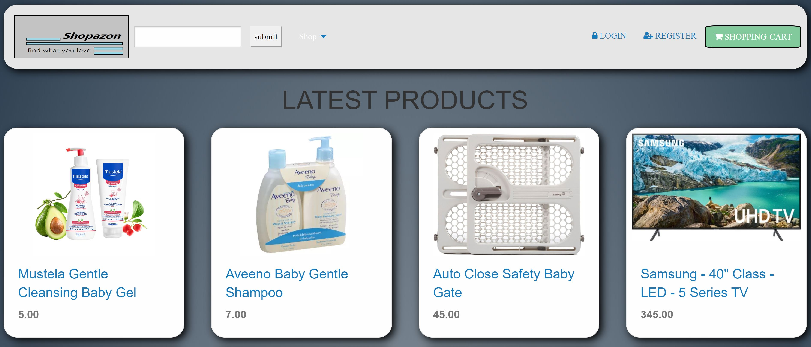

# Shopazon
A place to buy anything your heart desires...

## Table of Contents

- [Installation](#installation)
- [Usage](#usage)
- [Support](#support)
- [Contributing](#contributing)

## Installation

>link to live app: https://evening-mesa-27220.herokuapp.com/

- git clone git@github.com:jazznerd206/Project-Two.git
- add your own authentication variables where applicable (.env)

## Usage

- Shopazon
- Online shopping marketplace

- Usage instructions

    - To register/log in:
        - Click the appropriate link at the top of the page (register first if you have not done so)
        - Create an account using email and a password.
        - Creating an account does not log you into Stripe to allow purchases, that is done at time of transaction.

    - To buy product:
        - Select item, click "add to cart" link.
        - Click "view cart" link
        - Using the "purchase now" button, a modal will appear asking for stripe credentials. This will be where you enter your credit card information.
        - Congrats!! You have supported local businesses with this purchase.

## Support

Please [open an issue](https://github.com/jazznerd206/Project-Two/issues/new) for support.

## Contributing

Brought to you by Andrew, Dima, Gouri and Tyler!!

## License

Using Free Public License 1.0.0
